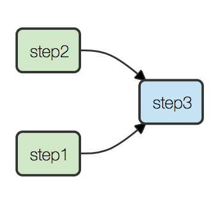
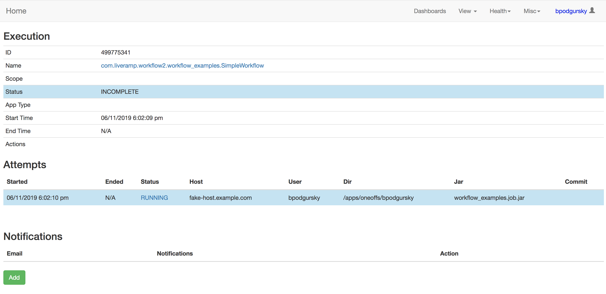
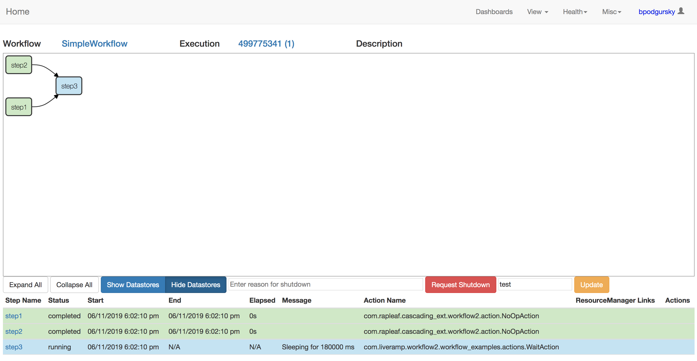
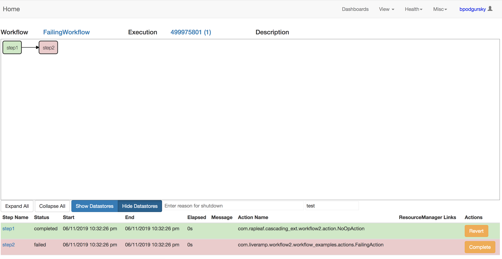
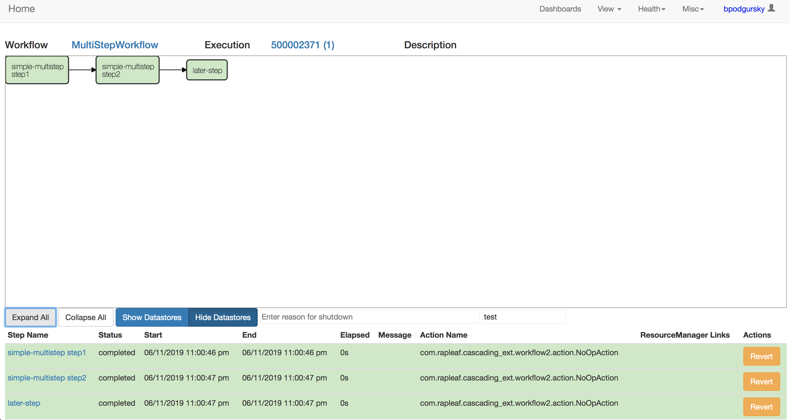
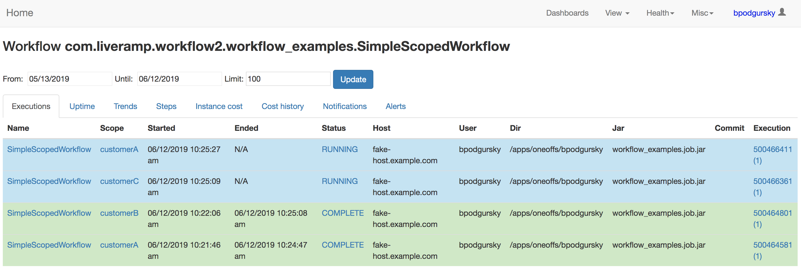
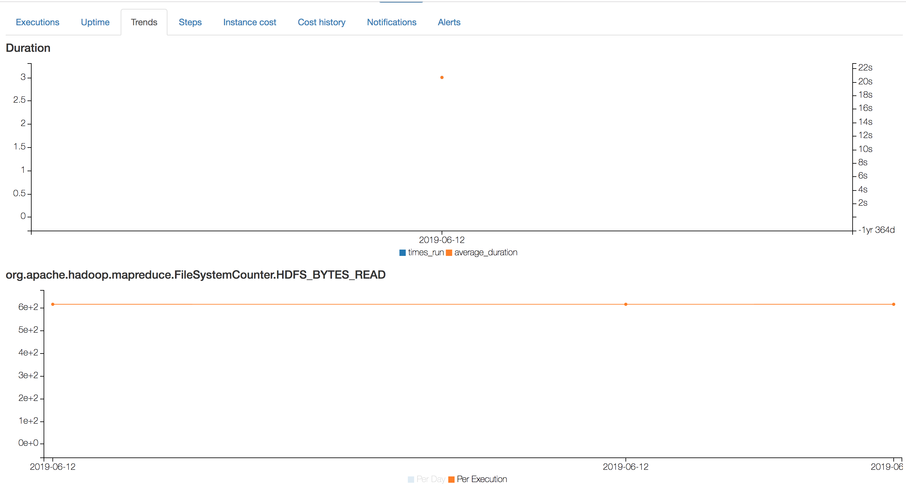
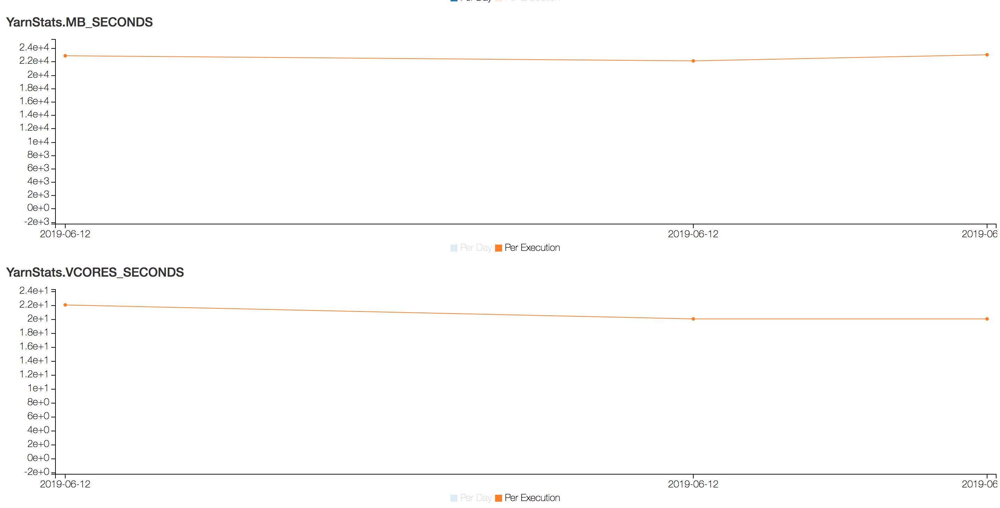

# Workflow2

## Overview

Workflow2 is a DAG processing engine LiveRamp uses to help engineers quickly build failure-resilient, high performance, complex batch data processing pipelines.  Workflow2 was built and is actively used at LiveRamp, and now is available as OSS.

## Why do I need a DAG processor?  Why can't I just write code?

You can!  But if your code is launching a series of remote big-data jobs (like a Spark or MapReduce job), stringing together those applications in a main method has drawbacks.  Running your code with a DAG processor provides a lot of features out of the box:

- **System visibility**: Humans can look at a UI to quickly see the status of the application.

- **Restartability**: If the application fails halfway through, you don't want to end in an inconsistent state or lose progress.

- **Reusability**: Sub-components of an application should be easy to share.

- **Analytics/history**: DAG frameworks capture historical timing info and failure histories.

- **Data framework integration**: Gather statistics from launched Hadoop applications and easily click through to their UIs.

- **Alerting**:  Get automatically alerted if the application fails or succeeds.

When a simple script turns into a multi-step application, it's probably time to start looking into a DAG processors to run it.

## So what is workflow2?

Workflow2 is the DAG processing framework LiveRamp uses to run all of its big data applications.

Workflow2 began (many, many years ago) as a simple in-memory DAG processor, and evolved into [blah]

## What distinguishes workflow2 from other DAG processors?

- Workflow2's DAGs -- both the structure and the actual operations -- are defined in Java

- Workflow2 was built with tight Hadoop integration (with an emphasis on MapReduce, and custom bindings for Cascading and Soark) (much more on this later).  These integrations provide tools for both application developers and provide global views into shared resource (eg Hadoop cluster) utilization for operations teams.

- Workflow2 is built to support very high numbers of concurrent applications and very high parallelism

  - LiveRamp runs > 100,000 DAG workflows per day

  - Individual DAGs may have hundreds of steps, hundreds of which may be running concurrently

  - At any given time, LiveRamp is running 500-1000 concurrent, independent workflows against the same deployment.

## Parts

A production deployment of workflow2 has a few moving parts:

- the __Workflow DB__ is a database which holds all system state

- The __Workflow UI__ is a web interface to allow users to view and modify system state

- The __Workflow Monitor__ is an asynchronous monitoring service which alerts users about poor-performing Hadoop applications and clients which have failed to heartbeat

- __Workflow Runner__ client processes submit and execute jobs

Each of these processes communicates exclusively through the Workflow DB instance:


This is an important point: neither the UI or monitor need to be running for executors to submit and execute work.  The UI server is simply a UI.

## Concepts

####Simple DAGs

_Actions_ run in a sequence defined by a DAG which is defined in user-code.  A very simple workflow looks like this:

```java
    Step step1 = new Step(new NoOpAction("step1"));

    Step step2 = new Step(new NoOpAction("step2"));

    Step step3 = new Step(new WaitAction("step3", 180_000), step1, step2);

    WorkflowRunners.dbRun(
        SimpleWorkflow.class.getName(),
        HadoopWorkflowOptions.test(),
        dbHadoopWorkflow -> Sets.newHashSet(step3)
    );
```

Our (very simple) Actions are defined in Java:

```java
public class NoOpAction extends Action {

  public NoOpAction(String checkpointToken) {
    super(checkpointToken);
  }

  @Override
  protected void execute() {
    // Deliberately do nothing.
  }
}

```

```java
public class WaitAction extends Action {

  private final long delay;
  
  public WaitAction(String checkpointToken, long delay) {
    super(checkpointToken);
    this.delay = delay;
  }

  @Override
  protected void execute() throws Exception {
    setStatusMessage("Sleeping for "+delay+" ms");
    Thread.sleep(delay);
  }
}
```

In this graph definition, Steps 1 and 2 can execute immediately.  Step 3 waits until both Steps 1 and 2 are complete, and then executes.  If we visualize this as a DAG, it looks like this:



When we call _WorkflowRunners.dbRun_, we tell the framework to do [asdf]

- Persist the workflow _structure_ to the database.  

- Begin executing steps, _in the local process_.  [To see how to execute code on remote workers, see BackgroundWorkflow]

When we initialize the workflow structure by invoking _WorkflowRunners.dbRun_, we create or re-use each of the following:

- We create __Step Attempts__ for every Step which will run

- We create a __Workflow Attempt__, which is conceptually "A set of steps which, if successful, will run an entire workflow"

- We either create or re-use a __Workflow Execution__.  If this is the first attempt at a workflow, create a new one.  If a previous attempt _failed_, we will re-use the previous execution.  More on this later.

- We either create or re-use an __Application__.  If this is the first time `com.liveramp.workflow2.workflow_examples.SimpleWorkflow` has ever run, we create a corresponding Application.

Because we told Workflow2 to execute against the database (dbRun), our state is entirely backed by the database, and we can track this state in the UI.  If we navigate to the Application's page, we can see all launched Executions:


Here we can see an old, complete Execution, and a new, running one.  We can click through to find more information about a specific Execution:



We see there is a single, running, Attempt associated with this Execution.  Last, we can inspect the running Attempt: 



Here we see in detail the workflow we just launched.  We see it has 3 steps, and the first two have already executed; the last is still running.  

#### Resuming

This is great, but what happens if a workflow fails halfway through?  Let's say our workflow failed on the second step:



When we call `.run` on a Workflow, it either _resumes_ an incomplete Execution or creates a new Execution:

- If the last Attempt did not complete the steps it defined, we create a new Attempt in the existing Execution

- If the last Attempt _did_ complete, we create a new Execution and start from the beginning.

In this case, the previous attempt failed, so the next Attempt will pick up right where we left off:


Notice that the first step was not re-executed -- it was skipped because it succeeded in the previous run.


#### Multi-Step Actions

Atomic steps are OK for simple applications, but often we want to package our Actions into larger re-usable components.  Workflow2 supports this via `MultiStepAction`s.  A MSA contains a graph of one or more Steps internally (these steps themselves can contain MSAs).  Here's a simple example:

```java
public class SimpleMSA extends HadoopMultiStepAction {
  
  public SimpleMSA(String checkpointToken, String tmpRoot) {
    super(checkpointToken, tmpRoot);

    Step step1 = new Step(new NoOpAction("step1"));

    Step step2 = new Step(new NoOpAction("step2"), step1);

    setSubStepsFromTails(step2);
  }

}
```

You can think of a MSA as a simple workflow -- steps can depend on each other, and the MSA binds the tails of the Action.  We can then embed this MSA into a complete workflow:

```java
    Step multiStep = new Step(new SimpleMSA("simple-multistep", "/tmp/dir"));

    Step tailStep = new Step(new NoOpAction("later-step"), multiStep);

    WorkflowRunners.dbRun(
        MultiStepWorkflow.class.getName(),
        HadoopWorkflowOptions.test(),
        dbHadoopWorkflow -> Sets.newHashSet(tailStep)
    );

```

When we run this workflow, the default UI view shows the steps collapsed, just like we wrote:


If we want to dig in to find details about the sub-steps which executed, we can expand the graph in the UI to show all component Steps:



Notice that the sub-component Step names are nested with the parent name -- this way, Step names within a MSA don't have to be globally unique, only unique within the MSA.

#### Scopes

Usually, we want to be able to run multiple concurrent Executions within the same Application.  For example, if my Application is `ImportDataFromCustomer`, we want to be able to import data from customer A and customer B concurrently.  We can enable this by adding a `scope` to the options:

```java
    Step step1 = new Step(new NoOpAction("step1"));
    Step step2 = new Step(new NoOpAction("step2"));
    Step step3 = new Step(new WaitAction("step3", 180_000), step1, step2);

    WorkflowRunners.dbRun(
        SimpleWorkflow.class.getName(),
        HadoopWorkflowOptions.test()
            .setScope(args[0]),
        dbHadoopWorkflow -> Sets.newHashSet(step3)
    );

``` 

__Only one Execution can run concurrently with a particlar scope__-- concurrent Executions are detected at startup, and fail loudly.  Usually this guarantee is important for maintaining data consistency, for example if a workflow uses a temporary directory scoped to a particular ID.

Now that we have set a scope, we can run many copies of this Application concurrently:



#### Resources

Beacuse we need to be able to resume a workflow when it fails, Steps cannot pass data to each other in-memory -- that data will be gone when the workflow resumes in a new JVM.  To persist local variables between steps, we need to use a `Resource`.  Actions can either `set` or `get` Resources:

```java
public class ResourceWriteAction extends Action {

  private final WriteResource<String> writeResource;

  public ResourceWriteAction(String checkpointToken,
                             Resource<String> toWrite) {
    super(checkpointToken);
    this.writeResource = creates(toWrite);
  }

  @Override
  protected void execute() throws Exception {
    set(writeResource, "Hello World!");
  }

}
```
and
```java
public class ResourceReadAction extends Action {

  private final ReadResource<String> toRead;

  public ResourceReadAction(String checkpointToken, Resource<String> toRead) {
    super(checkpointToken);
    this.toRead = readsFrom(toRead);
  }

  @Override
  protected void execute() throws Exception {
    setStatusMessage("Found resource value: "+ get(toRead));
  }
}

```
In the workflow definition, we use a `ResourceDeclarer` to declare the shared resource, and then pass the Resource to the Actions:

```java
    WorkflowRunners.dbRun(
        ResourcesWorkflow.class.getName(),
        HadoopWorkflowOptions.test()
            .setResourceManager(ResourceManagers.defaultResourceManager()),

        dbHadoopWorkflow -> {

          Resource<String> emptyResource = dbHadoopWorkflow.getManager().emptyResource("value-to-pass");

          Step resourceWriter = new Step(new ResourceWriteAction(
              "write-resource",
              emptyResource
          ));

          Step resourceReader = new Step(new ResourceReadAction(
              "read-resource",
              emptyResource
          ), resourceWriter);

          return Collections.singleton(resourceReader);

        }
    );

```

(the `dbHadoopWorkflow` is an `InitializedWorkflow` -- it is created when the workflow is initialized, and lets us interact with the database when the workflow structure is being built.)

When we run the workflow, we can see the value is passed:


Note that this would work _even if the second step had failed on its first Attempt_.


TODO data stores

## Hadoop integration

[Cascading](https://www.cascading.org/) is LiveRamp's weapon of choice for orchestrating MapReduce jobs, so this README will focus on Cascading integration; however, integrations also exist for raw MapReduce jobs, and are easy to write for other frameworks.

By integrating our workflow orchestration with our Hadoop orchestration we are able to make job submission easy, provide visibility into running jobs, and gather statistics to monitor both job and cluster health.

#### Job Submission

Launching a Cascading workflow via an Action is very simple.  Provide the Pipes and Taps, and the Action handles the rest:

```java
public class SimpleCascadingAction extends Action {

  private final TupleDataStore input;

  public SimpleCascadingAction(String checkpointToken, TupleDataStore input) {
    super(checkpointToken);

    this.input = input;
    readsFrom(input);
  }

  @Override
  protected void execute() throws Exception {

    Pipe pipe = new Pipe("pipe");

    completeWithProgress(buildFlow().connect(
        input.getTap(),
        new NullTap(),
        pipe
    ));

  }
}

```

Using a dummy action to [create a file](workflow_examples/src/main/java/com/liveramp/workflow2/workflow_examples/actions/SimpleWriteFile.java), we can run a simple workflow:

```java
    TupleDataStore store = new TupleDataStoreImpl("Temp Store",
        "/tmp/simple-cascading-flow/", "data",
        new Fields("line"),
        TextLine.class
    );

    WorkflowRunners.dbRun(
        SimpleCascadingFlow.class.getName(),
        HadoopWorkflowOptions.test(),
        dbHadoopWorkflow -> {

          Step writeFile = new Step(new SimpleWriteFile("write-data", store));

          Step readFile = new Step(new SimpleCascadingAction("read-data", store), writeFile);

          return Collections.singleton(readFile);
        }
    );

```

We get a few things for free now.  First, if we look at the Attempt page:


We get a link directly to the job on the ResourceManager.  Second, we've recorded all the counters from the job:


If this job runs more than once, we can now track the counters over time.  By navigating to the application page (which can also be filtered per-scope), we can see their history:



This lets us quickly answer questions like "Is this application reading or writing more data than yesterday?"  Or more often, "Is this application using more CPU and memory than yesterday?":



(YarnStats are a bonus added by our Cascading integration -- these track the total resources allocated to a YARN container, which includes setup time _not_ captured in MapReduce counters).

The `HadoopWorkflowOptions` object gives us many useful hooks to configure workflow performance.  One of the most commonly used ones is `addWorkflowProperties`, which we can use to attach arbitrary Hadoop properties to _every_ job launched within the workflow:

```java
    TupleDataStore store = new TupleDataStoreImpl("Temp Store",
        "/tmp/simple-cascading-flow/", "data",
        new Fields("line"),
        TextLine.class
    );

    WorkflowRunners.dbRun(
        CascadingFlowWithProperties.class.getName(),
        HadoopWorkflowOptions.test()
            .addWorkflowProperties(Collections.singletonMap("mapreduce.job.queuename", "root.default.custom"))
            .addWorkflowProperties(Collections.singletonMap("mapreduce.task.io.sort.mb", 300)),
        dbHadoopWorkflow -> {

          Step writeFile = new Step(new SimpleWriteFile("write-data", store));

          Step readFile = new Step(new SimpleCascadingAction("read-data", store), writeFile);

          return Collections.singleton(readFile);
        }
    );

```

Of course, properties can be overridden at the Step or Job level, but this is a useful programmatic hook to inject properties into an application.

#### Global Counter Views

    - global views
    - global warnings
    - task exceptions

## Non Hadoop workflows
  
Workflow2 was built primarily to support Hadoop jobs, but it is also sometimes valuable to be able to run workflows which do not reference Hadoop, and do not have Hadoop on the classpath.  This is possible using using `BaseStep`, `BaseAction`, and `BaseWorkflowRunner`, which are available via the `workflow_core` and `workflow_state` Maven artifacts (which, unlike `workflow_hadoop`, have no Hadoop dependencies):
  
```java
public class NoOpBaseAction extends BaseAction<Void> {

  public NoOpBaseAction(String checkpointToken) {
    super(checkpointToken);
  }

  @Override
  protected void execute() throws Exception {
    // Deliberately do nothing.
  }
}
```

To run the workflow, use `WorkflowDbRunners.baseWorkflowDbRunner`:

```java
    BaseStep<Void> step1 = new BaseStep<>(new NoOpBaseAction("step1"));
  
    BaseStep<Void> step2 = new BaseStep<>(new NoOpBaseAction("step2"), step1);
  
    WorkflowDbRunners.baseWorkflowDbRunner(
        SimpleNonHadoopWorkflow.class,
        CoreOptions.test(),
        step2
    );

```

This workflow runs against the database, but does not support Hadoop-specific integrations.

## UI features

The Workflow UI is built 

dashboards

manual completion

alerting

shutdown

died unclean

notifications

## Getting started

how to spin up
- sql db
- simple manifest
- example workflow


## Background Workflow


## Maven

## FAQ

#### Why is it called workflow2?

"Workflow" was already a bit overloaded.

#### Why doesn't the packaging line up with the maven artifacts?

Workflow2 is very widely used within LiveRamp, and repackaging would be a massive undertaking across our codebase; we prioritized OSSing the project over a 100% cleanup effort.  In a future major release we plan on aligning the packaging with the maven artifacts.

#### I like AirFlow better.

It's a free country, you can use AirFlow.

#### Did this project really start on June 4, 2019?

No.  Unfortunately, Workflow2 was entangled with our internal codebase, so we couldn't release the git history without also releasing proprietary code.  Workflow2 has been in development internally for many years, and gone through many iterations. 

#### How can I contribute / get help / report bugs / learn more?

We love contributions!  The best way to get in touch is to create a ticket or a pull request.
